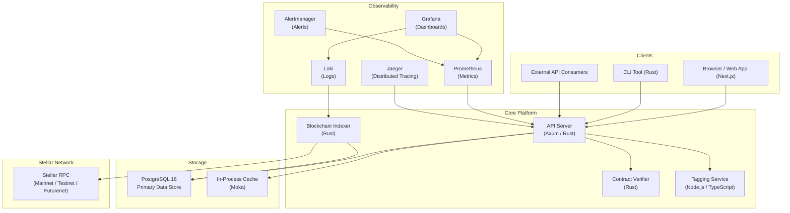
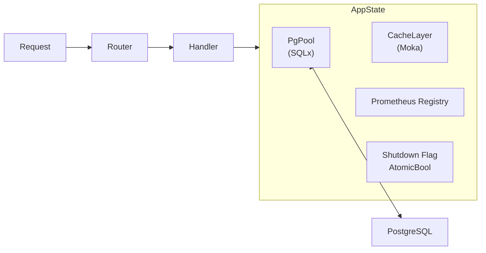
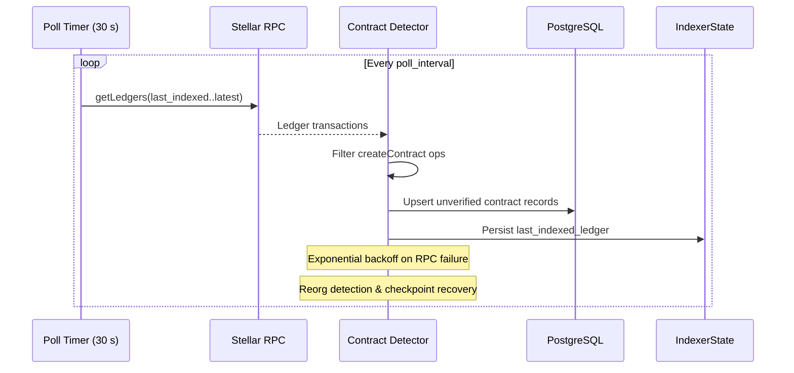
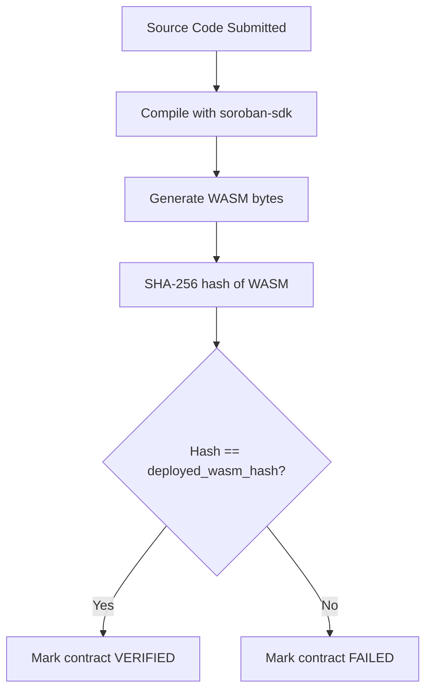
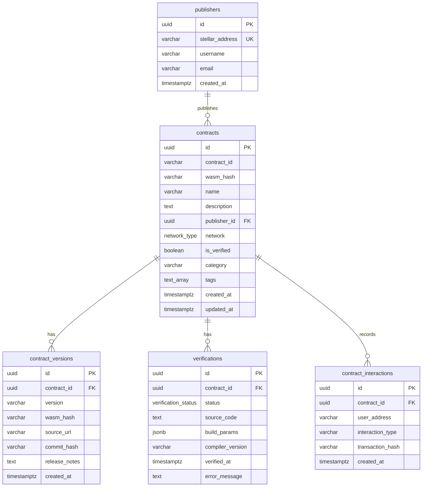
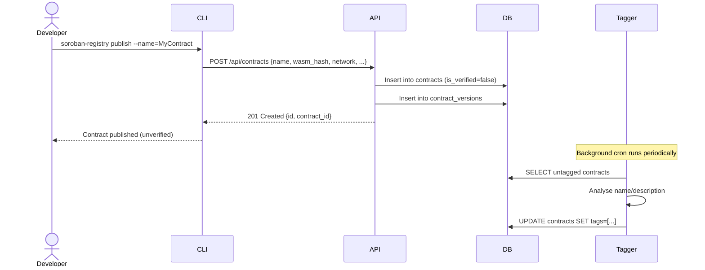
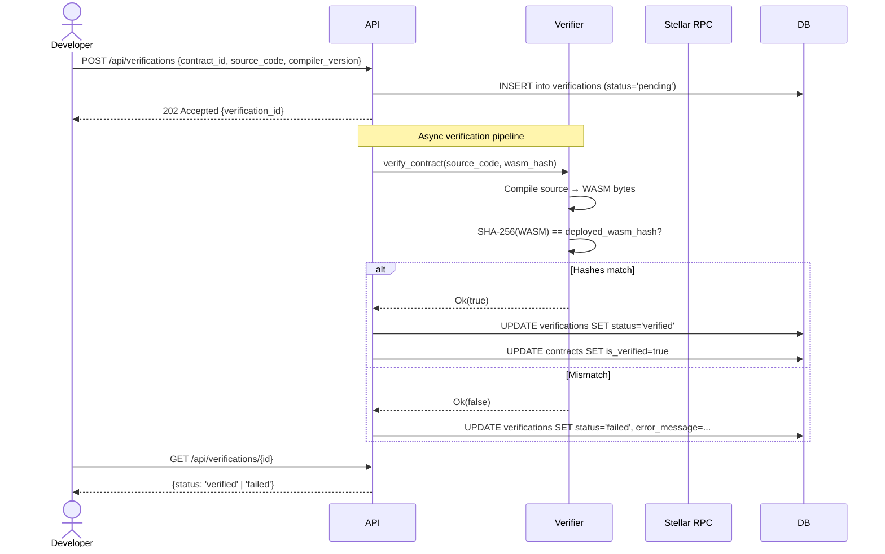
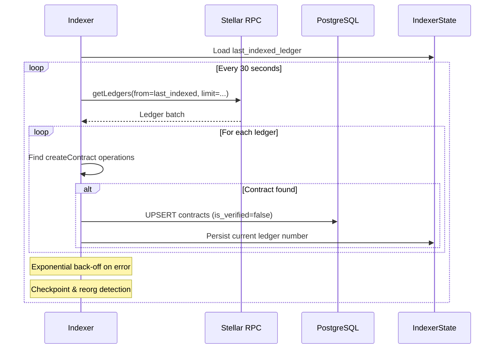
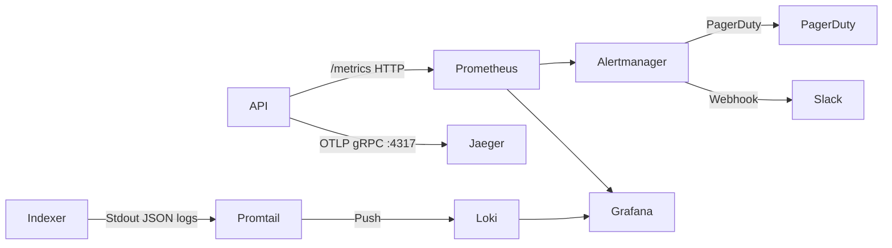

# Soroban Registry — Architecture

> **Audience:** Engineers onboarding to the project or making cross-cutting changes.  
> **Goal:** Understand how every major component fits together, how data flows through the system, and what architectural decisions have been made.

---

## Table of Contents

1. [High-Level Overview](#1-high-level-overview)
2. [Component Map](#2-component-map)
3. [Backend Services](#3-backend-services)
   - 3.1 [API Server](#31-api-server)
   - 3.2 [Blockchain Indexer](#32-blockchain-indexer)
   - 3.3 [Contract Verifier](#33-contract-verifier)
   - 3.4 [Tagging Service](#34-tagging-service)
   - 3.5 [Shared Library](#35-shared-library)
4. [Frontend](#4-frontend)
5. [CLI](#5-cli)
6. [Database Schema](#6-database-schema)
7. [Data Flow](#7-data-flow)
   - 7.1 [Contract Publication Flow](#71-contract-publication-flow)
   - 7.2 [Verification Flow](#72-verification-flow)
   - 7.3 [Indexing Flow](#73-indexing-flow)
8. [Caching Strategy](#8-caching-strategy)
9. [Observability Stack](#9-observability-stack)
10. [Security Model](#10-security-model)

---

## 1. High-Level Overview

Soroban Registry is the package manager and contract registry for the Stellar/Soroban ecosystem — analogous to `crates.io` for Rust. It lets developers publish, discover, and verify smart contracts across Mainnet, Testnet, and Futurenet.



---

## 2. Component Map

| Component | Language | Location | Port | Role |
|---|---|---|---|---|
| API Server | Rust (Axum) | `backend/api/` | 3001 | REST API gateway; all business logic |
| Blockchain Indexer | Rust | `backend/indexer/` | — | Polls Stellar RPC, persists contracts |
| Contract Verifier | Rust | `backend/verifier/` | — | Compiles & compares WASM bytecode |
| Tagging Service | TypeScript (Node.js) | `tagging-service/` | 3002 | Manages contract tags via cron + REST |
| Frontend | TypeScript (Next.js 14) | `frontend/` | 3000 | Web UI |
| CLI | Rust | `cli/` | — | Developer command-line tool |
| Shared Library | Rust | `backend/shared/` | — | Types, errors, ABI, semver utils |
| Database | PostgreSQL 16 | `database/migrations/` | 5432 | Persistent storage |

---

## 3. Backend Services

### 3.1 API Server

**Technology:** Rust · [Axum](https://github.com/tokio-rs/axum) · SQLx · Moka

The API server is the single entry-point for all client traffic. It owns:

- **Route registration** — grouped routes are assembled in `routes.rs` and mounted onto the Axum router in `main.rs`.
- **Application state** (`AppState`) — shared across every handler via Axum's state-injection mechanism.
- **In-process caching** — an `Arc<CacheLayer>` (backed by Moka) lives inside `AppState`.
- **Metrics collection** — a Prometheus `Registry` is embedded in `AppState` and exposed at `/metrics`.



**Route groups** (defined in `routes.rs`):

| Group | Prefix | Examples |
|---|---|---|
| Contracts | `/api/contracts` | list, publish, get, versions, interactions |
| Publishers | `/api/publishers` | CRUD |
| Verifications | `/api/verifications` | submit, status |
| Analytics | `/api/analytics` | trending, usage |
| Governance | `/api/governance` | proposals, voting |
| Quality | `/api/quality` | scores, gates |
| Security | `/api/scan`, `/api/signing` | vulnerability scan, package signing |
| Observability | `/metrics`, `/health` | Prometheus scrape endpoint, health check |

**Health check pattern:**  
`GET /health` returns `200 OK` with service uptime. Docker and Kubernetes readiness probes use this endpoint.

---

### 3.2 Blockchain Indexer

**Technology:** Rust · SQLx · tokio

The indexer runs as a **separate long-running process** that continuously monitors the Stellar blockchain and writes new contracts to the database.



**Key modules:**

| Module | Purpose |
|---|---|
| `config.rs` | Reads `STELLAR_NETWORK`, `STELLAR_RPC_*` env vars |
| `rpc.rs` | Stellar RPC client, ledger polling |
| `detector.rs` | Identifies `createContract` operations |
| `db.rs` | Writes new contracts to `contracts` table |
| `state.rs` | Tracks the last successfully indexed ledger |
| `reorg.rs` | Detects and handles ledger reorganisations |
| `backoff.rs` | Exponential back-off for transient RPC failures |

**Supported networks:**

| Network | Default RPC Endpoint |
|---|---|
| Mainnet | `https://rpc-mainnet.stellar.org` |
| Testnet | `https://rpc-testnet.stellar.org` |
| Futurenet | `https://rpc-futurenet.stellar.org` |

---

### 3.3 Contract Verifier

**Technology:** Rust · soroban-sdk

The verifier is a **library crate** (`backend/verifier/`) consumed by the API server. Its purpose is to prove that a contract's published source code compiles to exactly the WASM bytecode that is deployed on-chain.



> **Current status:** The verification engine scaffolding is in place; the compilation step (`compile_contract`) is pending implementation. The API stores verification jobs in the `verifications` table and processes them asynchronously.

---

### 3.4 Tagging Service

**Technology:** TypeScript · Node.js · `pg`

A lightweight microservice responsible for automated contract tagging. It exposes a small REST API and runs a background cron job that analyses newly indexed contracts and assigns semantic tags.

**Source layout:**

| File | Role |
|---|---|
| `src/index.ts` | Express app bootstrap |
| `src/controller.ts` | HTTP route handlers |
| `src/models.ts` | Database query layer |
| `src/cron.ts` | Scheduled tag-generation job |
| `src/db.ts` | PostgreSQL connection pool |

---

### 3.5 Shared Library

The `backend/shared/` crate provides types and utilities used across all backend crates to avoid duplication:

| Module | Exports |
|---|---|
| `models.rs` | `Contract`, `Publisher`, `ContractVersion`, `Network` enum |
| `error.rs` | `RegistryError` — unified error type |
| `abi.rs` | ABI parsing and generation helpers |
| `semver.rs` | Semantic version comparison |
| `upgrade.rs` | Contract upgrade strategy types |

---

## 4. Frontend

**Technology:** Next.js 14 (App Router) · TypeScript · Tailwind CSS

The frontend is a server-side-rendered React application. It communicates with the API server via `NEXT_PUBLIC_API_URL`.

```
frontend/
├── app/           — Next.js App Router pages and layouts
├── components/    — Reusable React components
├── hooks/         — Custom React hooks (data fetching, state)
├── services/      — API client functions (fetch wrappers)
├── providers/     — Context providers (auth, theme)
├── lib/           — Utility functions
├── types/         — TypeScript type definitions
└── utils/         — Shared frontend utilities
```

---

## 5. CLI

**Technology:** Rust · `clap`

The CLI (`cli/`) is a standalone binary that wraps the REST API for developer workflows. It is distributed as a single static binary.

Major command groups (defined in `src/commands.rs`):

| Command | Description |
|---|---|
| `publish` | Publish a new contract or version |
| `verify` | Submit source code for verification |
| `search` / `info` | Query the registry |
| `import` / `export` | Bulk contract data management |
| `batch-verify` | Verify multiple contracts in parallel |
| `multisig` | Multi-signature deployment workflows |
| `patch` | Apply upgrades to deployed contracts |
| `fuzz` | Fuzz-testing helpers |
| `formal-verify` | Trigger formal verification runs |
| `sla` | Service-level agreement monitoring |

---

## 6. Database Schema

PostgreSQL 16 is the primary data store. Migrations live in `database/migrations/` and are applied with SQLx.



**Custom types:**

```sql
CREATE TYPE network_type AS ENUM ('mainnet', 'testnet', 'futurenet');
CREATE TYPE verification_status AS ENUM ('pending', 'verified', 'failed');
```

**Extended schema** (added via subsequent migrations):

| Migration | Feature |
|---|---|
| `002_add_abi.sql` | ABI storage for contracts |
| `003_analytics.sql` | Download counters, analytics events |
| `006_dependencies.sql` | Contract dependency graph |
| `007_reviews.sql` | Community reviews |
| `008_tagging.sql` | Tag taxonomy tables |
| `011_popularity_score.sql` | Computed popularity metrics |
| `014_audit_log.sql` | Immutable audit log with row-level events |
| `026_full_text_search.sql` | `tsvector` columns + GIN indexes for search |
| `030_formal_verification.sql` | Formal verification run records |
| `032_package_signing.sql` | Cryptographic package signatures |
| `036_network_configs.sql` | Per-network RPC configuration |

---

## 7. Data Flow

### 7.1 Contract Publication Flow



### 7.2 Verification Flow



### 7.3 Indexing Flow



---

## 8. Caching Strategy

The API server uses **Moka** — a high-performance, concurrent in-process cache built on Caffeine's design.

Two named caches live inside `CacheLayer`, both scoped to `AppState`:

| Cache | Key | TTL | Max Capacity | Purpose |
|---|---|---|---|---|
| `abi_cache` | `contract_id` | 24 hours | Configurable (default 10 000 weighted entries) | ABI JSON / OpenAPI documents |
| `verification_cache` | `wasm_hash` | 7 days | Configurable | Verification results keyed by bytecode hash |

**Configuration via environment variables:**

```
CACHE_ENABLED=true          # Toggle caching on/off (default: true)
CACHE_MAX_CAPACITY=10000    # Max weighted entries (per cache)
```

**Invalidation rules:**

- ABI cache entries expire after 24 hours (TTL-based).
- Verification cache entries expire after 7 days (TTL-based; verification results are immutable by nature).
- There is no explicit manual invalidation — TTL expiry is the sole mechanism.
- Disabling caching (`CACHE_ENABLED=false`) bypasses both caches for every request (useful in development or CI).

**Cache sizing rationale:**  
Both caches use a **weigher** that counts entry size in bytes (`v.len()`). The `max_capacity` ceiling therefore bounds total memory by byte-weight, not entry count, aligning with Moka's weight-based eviction.

---

## 9. Observability Stack

The full observability stack is defined in `docker-compose.yml` and configured under `observability/`.



| Tool | Port | Role |
|---|---|---|
| Jaeger | 16686 (UI), 4317 (OTLP gRPC) | Distributed request tracing |
| Prometheus | 9090 | Metrics collection & storage |
| Alertmanager | 9093 | Alert routing (Slack, PagerDuty) |
| Loki | 3100 | Log aggregation |
| Promtail | — | Log shipping agent |
| Grafana | 3000 (observability stack) | Unified dashboards |

---

## 10. Security Model

| Concern | Mechanism |
|---|---|
| Authentication | JWT-based auth middleware (`auth_middleware.rs`) |
| Authorization | Role-based checks inside handlers |
| Rate limiting | Per-IP rate limiting (`rate_limit.rs`) |
| Package integrity | Cryptographic package signing (`032_package_signing.sql`, `signing_handlers.rs`) |
| Audit trail | Immutable row-level audit log (`014_audit_log.sql`, `audit_handlers.rs`) |
| Vulnerability scanning | Automated dependency and code scanning (`scan_handlers.rs`) |
| Formal verification | On-chain property verification (`030_formal_verification.sql`) |
| Multi-sig deployments | Multi-signature workflow support (`multisig_handlers.rs`) |
