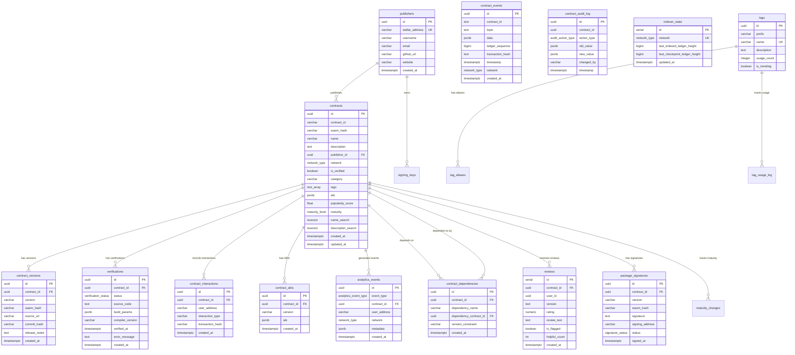

# Soroban Registry — Database Schema

> **Audience:** Backend engineers adding features, fixing bugs, or running migrations.  
> **Database:** PostgreSQL 16  
> **Migration tool:** `sqlx-cli` — files live in `database/migrations/`

---

## Table of Contents

1. [Custom Types (ENUMs)](#1-custom-types-enums)
2. [Core Tables](#2-core-tables)
   - 2.1 [publishers](#21-publishers)
   - 2.2 [contracts](#22-contracts)
   - 2.3 [contract\_versions](#23-contract_versions)
   - 2.4 [verifications](#24-verifications)
   - 2.5 [contract\_interactions](#25-contract_interactions)
3. [ABI & OpenAPI](#3-abi--openapi)
   - 3.1 [contract\_abis](#31-contract_abis)
4. [Events & Analytics](#4-events--analytics)
   - 4.1 [contract\_events](#41-contract_events)
   - 4.2 [analytics\_events](#42-analytics_events)
   - 4.3 [analytics\_daily\_aggregates](#43-analytics_daily_aggregates)
5. [Tagging](#5-tagging)
   - 5.1 [tags](#51-tags)
   - 5.2 [tag\_aliases](#52-tag_aliases)
   - 5.3 [tag\_usage\_log](#53-tag_usage_log)
6. [Reviews](#6-reviews)
   - 6.1 [reviews](#61-reviews)
   - 6.2 [review\_votes](#62-review_votes)
   - 6.3 [review\_flags](#63-review_flags)
7. [Dependencies](#7-dependencies)
   - 7.1 [contract\_dependencies](#71-contract_dependencies)
8. [Audit & History](#8-audit--history)
   - 8.1 [contract\_audit\_log](#81-contract_audit_log)
   - 8.2 [contract\_snapshots](#82-contract_snapshots)
9. [Package Signing](#9-package-signing)
   - 9.1 [package\_signatures](#91-package_signatures)
   - 9.2 [signature\_revocations](#92-signature_revocations)
   - 9.3 [signing\_keys](#93-signing_keys)
10. [Indexer State](#10-indexer-state)
    - 10.1 [indexer\_state](#101-indexer_state)
11. [Maturity Levels](#11-maturity-levels)
    - 11.1 [maturity\_changes](#111-maturity_changes)
12. [Full-Text Search Columns](#12-full-text-search-columns)
13. [Entity Relationship Diagram](#13-entity-relationship-diagram)
14. [Indexes Reference](#14-indexes-reference)
15. [Shared Database Functions & Triggers](#15-shared-database-functions--triggers)

---

## 1. Custom Types (ENUMs)

| Type | Values | Defined in |
|---|---|---|
| `network_type` | `mainnet`, `testnet`, `futurenet` | `001_initial.sql` |
| `verification_status` | `pending`, `verified`, `failed` | `001_initial.sql` |
| `analytics_event_type` | `contract_published`, `contract_verified`, `contract_deployed`, `version_created` | `003_analytics.sql` |
| `audit_action_type` | `contract_published`, `metadata_updated`, `verification_changed`, `publisher_changed`, `version_created`, `rollback` | `014_audit_log.sql` |
| `contract_event_type` | composite (`topic TEXT`, `data JSONB`) | `016_contract_events.sql` |
| `migration_status` | `pending`, `success`, `failed`, `rolled_back` | `005_create_migrations_table.sql` |
| `signature_status` | `valid`, `revoked`, `expired` | `032_package_signing.sql` |
| `transparency_entry_type` | `package_signed`, `signature_verified`, `signature_revoked`, `key_rotated` | `032_package_signing.sql` |
| `maturity_level` | `alpha`, `beta`, `stable`, `mature`, `legacy` | `019_maturity_levels.sql` |

---

## 2. Core Tables

### 2.1 `publishers`

Represents a developer or organisation that publishes contracts.

**Migration:** `001_initial.sql`

| Column | Type | Nullable | Default | Description |
|---|---|---|---|---|
| `id` | `UUID` | NOT NULL | `gen_random_uuid()` | Primary key |
| `stellar_address` | `VARCHAR(56)` | NOT NULL | — | Publisher's Stellar G-address (56 chars). Unique. |
| `username` | `VARCHAR(255)` | nullable | — | Display name |
| `email` | `VARCHAR(255)` | nullable | — | Contact email |
| `github_url` | `VARCHAR(500)` | nullable | — | GitHub profile URL |
| `website` | `VARCHAR(500)` | nullable | — | Personal / organisation website |
| `created_at` | `TIMESTAMPTZ` | NOT NULL | `NOW()` | Row creation timestamp |

**Constraints:**
- `PRIMARY KEY (id)`
- `UNIQUE (stellar_address)`

**Indexes:**
- `idx_publishers_stellar_address` on `stellar_address` — fast lookup by Stellar address

---

### 2.2 `contracts`

The central table. One row per deployed contract per network.

**Migration:** `001_initial.sql`, with columns added by later migrations (see below).

| Column | Type | Nullable | Default | Description |
|---|---|---|---|---|
| `id` | `UUID` | NOT NULL | `gen_random_uuid()` | Primary key |
| `contract_id` | `VARCHAR(56)` | NOT NULL | — | On-chain Soroban contract address |
| `wasm_hash` | `VARCHAR(64)` | NOT NULL | — | SHA-256 hex of the deployed WASM bytecode |
| `name` | `VARCHAR(255)` | NOT NULL | — | Human-readable contract name |
| `description` | `TEXT` | nullable | — | Long-form description |
| `publisher_id` | `UUID` | NOT NULL | — | FK → `publishers.id` (CASCADE DELETE) |
| `network` | `network_type` | NOT NULL | — | `mainnet` \| `testnet` \| `futurenet` |
| `is_verified` | `BOOLEAN` | NOT NULL | `FALSE` | Source verification status |
| `category` | `VARCHAR(100)` | nullable | — | Contract category (e.g. `dex`, `token`) |
| `tags` | `TEXT[]` | — | `'{}'` | Array of free-form tag strings |
| `abi` | `JSONB` | nullable | — | Inline ABI document (added in `002_add_abi.sql`) |
| `popularity_score` | `DOUBLE PRECISION` | NOT NULL | `0.0` | Computed ranking score (added in `011_popularity_score.sql`) |
| `score_updated_at` | `TIMESTAMPTZ` | nullable | — | When popularity score was last recalculated |
| `maturity` | `maturity_level` | NOT NULL | `'alpha'` | Contract lifecycle stage (added in `019_maturity_levels.sql`) |
| `name_search` | `tsvector` | — | GENERATED | Full-text search vector for `name`, **english** stemming (added in `026_full_text_search.sql`) |
| `description_search` | `tsvector` | — | GENERATED | Full-text search vector for `description` (added in `026_full_text_search.sql`) |
| `created_at` | `TIMESTAMPTZ` | NOT NULL | `NOW()` | Row creation timestamp |
| `updated_at` | `TIMESTAMPTZ` | NOT NULL | `NOW()` | Auto-updated by trigger on every UPDATE |

**Constraints:**
- `PRIMARY KEY (id)`
- `UNIQUE (contract_id, network)` — the same on-chain contract cannot appear twice on the same network

**Foreign Keys:**
- `publisher_id` → `publishers(id)` ON DELETE CASCADE

**Trigger:**
- `update_contracts_updated_at` — sets `updated_at = NOW()` before every UPDATE

---

### 2.3 `contract_versions`

Tracks individual releases of a contract. Multiple versions per `contracts` row.

**Migration:** `001_initial.sql`

| Column | Type | Nullable | Default | Description |
|---|---|---|---|---|
| `id` | `UUID` | NOT NULL | `gen_random_uuid()` | Primary key |
| `contract_id` | `UUID` | NOT NULL | — | FK → `contracts.id` (CASCADE DELETE) |
| `version` | `VARCHAR(50)` | NOT NULL | — | SemVer string, e.g. `1.0.0` |
| `wasm_hash` | `VARCHAR(64)` | NOT NULL | — | SHA-256 of this version's WASM |
| `source_url` | `VARCHAR(500)` | nullable | — | URL to source repository for this version |
| `commit_hash` | `VARCHAR(40)` | nullable | — | Git commit SHA (40 chars) |
| `release_notes` | `TEXT` | nullable | — | Changelog / release notes |
| `created_at` | `TIMESTAMPTZ` | NOT NULL | `NOW()` | Row creation timestamp |

**Constraints:**
- `PRIMARY KEY (id)`
- `UNIQUE (contract_id, version)` — no two rows for the same version of the same contract

**Foreign Keys:**
- `contract_id` → `contracts(id)` ON DELETE CASCADE

**Indexes:**
- `idx_contract_versions_contract_id` on `contract_id`

---

### 2.4 `verifications`

One row per source-verification attempt for a contract.

**Migration:** `001_initial.sql`

| Column | Type | Nullable | Default | Description |
|---|---|---|---|---|
| `id` | `UUID` | NOT NULL | `gen_random_uuid()` | Primary key |
| `contract_id` | `UUID` | NOT NULL | — | FK → `contracts.id` (CASCADE DELETE) |
| `status` | `verification_status` | NOT NULL | `'pending'` | `pending` \| `verified` \| `failed` |
| `source_code` | `TEXT` | nullable | — | Full Rust source submitted for verification |
| `build_params` | `JSONB` | nullable | — | Compiler flags, features, target triple |
| `compiler_version` | `VARCHAR(50)` | nullable | — | `soroban-sdk` / `rustc` version used |
| `verified_at` | `TIMESTAMPTZ` | nullable | — | Timestamp when status became `verified` |
| `error_message` | `TEXT` | nullable | — | Compiler or hash-mismatch error detail |
| `created_at` | `TIMESTAMPTZ` | NOT NULL | `NOW()` | Row creation timestamp |

**Foreign Keys:**
- `contract_id` → `contracts(id)` ON DELETE CASCADE

**Indexes:**
- `idx_verifications_contract_id` on `contract_id`
- `idx_verifications_status` on `status`

---

### 2.5 `contract_interactions`

Lightweight event log for on-chain interactions with a contract.

**Migration:** `001_initial.sql`

| Column | Type | Nullable | Default | Description |
|---|---|---|---|---|
| `id` | `UUID` | NOT NULL | `gen_random_uuid()` | Primary key |
| `contract_id` | `UUID` | NOT NULL | — | FK → `contracts.id` (CASCADE DELETE) |
| `user_address` | `VARCHAR(56)` | nullable | — | Stellar address of the caller |
| `interaction_type` | `VARCHAR(50)` | NOT NULL | — | e.g. `invoke`, `deploy` |
| `transaction_hash` | `VARCHAR(64)` | nullable | — | Stellar transaction hash |
| `created_at` | `TIMESTAMPTZ` | NOT NULL | `NOW()` | Row creation timestamp |

**Foreign Keys:**
- `contract_id` → `contracts(id)` ON DELETE CASCADE

**Indexes:**
- `idx_contract_interactions_contract_id`
- `idx_contract_interactions_created_at`

---

## 3. ABI & OpenAPI

### 3.1 `contract_abis`

Versioned ABI documents for a contract. Enables historic ABI lookups per version.

**Migration:** `002_add_abi.sql`

| Column | Type | Nullable | Default | Description |
|---|---|---|---|---|
| `id` | `UUID` | NOT NULL | `gen_random_uuid()` | Primary key |
| `contract_id` | `UUID` | NOT NULL | — | FK → `contracts.id` (CASCADE DELETE) |
| `version` | `VARCHAR(50)` | NOT NULL | — | Contract version this ABI belongs to |
| `abi` | `JSONB` | NOT NULL | — | Full ABI document as JSON |
| `created_at` | `TIMESTAMPTZ` | NOT NULL | `NOW()` | Row creation timestamp |

**Constraints:**
- `UNIQUE (contract_id, version)`

**Indexes:**
- `idx_contract_abis_contract_id`

> The `contracts.abi` column (added in the same migration) stores the **latest** ABI inline for quick access, while `contract_abis` stores the full version history.

---

## 4. Events & Analytics

### 4.1 `contract_events`

Indexes events emitted by contracts on the Stellar blockchain.

**Migration:** `016_contract_events.sql`

| Column | Type | Nullable | Default | Description |
|---|---|---|---|---|
| `id` | `UUID` | NOT NULL | `gen_random_uuid()` | Primary key |
| `contract_id` | `TEXT` | NOT NULL | — | On-chain contract address (not a FK, allows indexing before registration) |
| `topic` | `TEXT` | NOT NULL | — | Event topic / name |
| `data` | `JSONB` | nullable | — | Event payload |
| `ledger_sequence` | `BIGINT` | NOT NULL | — | Ledger number this event was emitted in |
| `transaction_hash` | `TEXT` | nullable | — | Containing transaction hash |
| `timestamp` | `TIMESTAMPTZ` | NOT NULL | `NOW()` | Event emission time |
| `network` | `network_type` | NOT NULL | `'testnet'` | Network the event came from |
| `created_at` | `TIMESTAMPTZ` | NOT NULL | `NOW()` | Row insertion timestamp |

**Constraints:**
- `UNIQUE (contract_id, ledger_sequence, transaction_hash)` — deduplication guard

**Indexes:**
- `idx_contract_events_contract_id`
- `idx_contract_events_topic`
- `idx_contract_events_ledger`
- `idx_contract_events_timestamp DESC`
- `idx_contract_events_network`
- `idx_contract_events_contract_topic` on `(contract_id, topic)`
- `idx_contract_events_data` — GIN index on the `data` JSONB column
- `idx_contract_events_query` on `(contract_id, topic, timestamp DESC)` — covers the most common query pattern

**Retention:**  
A companion table `event_retention_policies` (per-contract or default) and the `clean_old_events()` function implement time-based pruning (default: 1 year).

---

### 4.2 `analytics_events`

Raw analytical event stream for registry activity (publish, verify, deploy).

**Migration:** `003_analytics.sql`

| Column | Type | Nullable | Default | Description |
|---|---|---|---|---|
| `id` | `UUID` | NOT NULL | `gen_random_uuid()` | Primary key |
| `event_type` | `analytics_event_type` | NOT NULL | — | `contract_published` \| `contract_verified` \| `contract_deployed` \| `version_created` |
| `contract_id` | `UUID` | NOT NULL | — | FK → `contracts.id` (CASCADE DELETE) |
| `user_address` | `VARCHAR(56)` | nullable | — | Actor Stellar address |
| `network` | `network_type` | nullable | — | Network context |
| `metadata` | `JSONB` | — | `'{}'` | Arbitrary event metadata |
| `created_at` | `TIMESTAMPTZ` | NOT NULL | `NOW()` | Event timestamp |

**Indexes:**
- `idx_analytics_events_contract_created` on `(contract_id, created_at)`
- `idx_analytics_events_type_created` on `(event_type, created_at)`
- `idx_analytics_events_created_at`

---

### 4.3 `analytics_daily_aggregates`

Pre-aggregated daily statistics per contract.

**Migration:** `003_analytics.sql`

| Column | Type | Description |
|---|---|---|
| `id` | `UUID` | Primary key |
| `contract_id` | `UUID` | FK → `contracts.id` (CASCADE DELETE) |
| `date` | `DATE` | Aggregation date |
| `deployment_count` | `INTEGER` | Deployments that day |
| `unique_deployers` | `INTEGER` | Distinct deployer addresses |
| `verification_count` | `INTEGER` | Verifications submitted |
| `publish_count` | `INTEGER` | Publish events |
| `version_count` | `INTEGER` | New versions created |
| `total_events` | `INTEGER` | Sum of all events |
| `unique_users` | `INTEGER` | Distinct users |
| `network_breakdown` | `JSONB` | Per-network event counts `{"mainnet": N, ...}` |
| `top_users` | `JSONB` | Array of top user addresses `[{address, count}]` |
| `created_at` / `updated_at` | `TIMESTAMPTZ` | Managed by trigger |

**Constraints:**
- `UNIQUE (contract_id, date)`

---

## 5. Tagging

### 5.1 `tags`

Canonical tag definitions. Tags are namespaced by `prefix` (e.g. `category:dex`).

**Migration:** `008_tagging.sql`

| Column | Type | Description |
|---|---|---|
| `id` | `UUID` | Primary key |
| `prefix` | `VARCHAR(100)` | Namespace, e.g. `category`, `language` |
| `name` | `VARCHAR(255)` | Tag label within the namespace |
| `description` | `TEXT` | Human-readable description of the tag |
| `usage_count` | `INTEGER` | How many contracts use this tag |
| `is_trending` | `BOOLEAN` | Whether the tag is currently trending |
| `created_at` / `updated_at` | `TIMESTAMPTZ` | Managed by trigger |

**Constraints:**
- `UNIQUE (prefix, name)`

**Indexes:**
- `idx_tags_prefix`
- `idx_tags_usage_count DESC`
- `idx_tags_is_trending WHERE is_trending = TRUE` — partial index, only indexes trending rows
- `idx_tags_prefix_name` composite

---

### 5.2 `tag_aliases`

Maps alternative / deprecated tag strings to their canonical `tags` entry.

**Migration:** `008_tagging.sql`

| Column | Type | Description |
|---|---|---|
| `id` | `UUID` | Primary key |
| `alias` | `VARCHAR(255)` | The alternative tag string. Unique. |
| `canonical_tag_id` | `UUID` | FK → `tags.id` (CASCADE DELETE) |
| `created_at` | `TIMESTAMPTZ` | Row creation timestamp |

---

### 5.3 `tag_usage_log`

Time-series snapshots of tag usage counts for trend analysis.

**Migration:** `008_tagging.sql`

| Column | Type | Description |
|---|---|---|
| `id` | `UUID` | Primary key |
| `tag_id` | `UUID` | FK → `tags.id` (CASCADE DELETE) |
| `usage_count` | `INTEGER` | Count at time of recording |
| `recorded_at` | `TIMESTAMPTZ` | Snapshot timestamp |

---

## 6. Reviews

### 6.1 `reviews`

Community ratings and written reviews for contracts.

**Migration:** `007_reviews.sql`

| Column | Type | Description |
|---|---|---|
| `id` | `SERIAL` | Primary key (integer autoincrement) |
| `contract_id` | `UUID` | FK → `contracts.id` (CASCADE DELETE) |
| `user_id` | `UUID` | Reviewer identifier |
| `version` | `TEXT` | Contract version reviewed |
| `rating` | `NUMERIC(2,1)` | Score from `1.0` to `5.0` — CHECK constraint enforced |
| `review_text` | `TEXT` | Written review body |
| `is_flagged` | `BOOLEAN` | Moderation flag |
| `helpful_count` | `INT` | Upvotes from other users |
| `created_at` / `updated_at` | `TIMESTAMPTZ` | Row timestamps |

---

### 6.2 `review_votes`

Tracks helpful / unhelpful votes on reviews.

**Migration:** `007_reviews.sql`

| Column | Type | Description |
|---|---|---|
| `id` | `SERIAL` | Primary key |
| `review_id` | `INT` | FK → `reviews.id` (CASCADE DELETE) |
| `user_id` | `UUID` | Voter |
| `vote` | `BOOLEAN` | `TRUE` = helpful, `FALSE` = unhelpful |
| `created_at` | `TIMESTAMPTZ` | Vote timestamp |

**Constraints:**
- `UNIQUE (review_id, user_id)` — one vote per user per review

---

### 6.3 `review_flags`

Moderation queue for reported reviews.

**Migration:** `007_reviews.sql`

| Column | Type | Description |
|---|---|---|
| `id` | `SERIAL` | Primary key |
| `review_id` | `INT` | FK → `reviews.id` (CASCADE DELETE) |
| `user_id` | `UUID` | User who flagged |
| `reason` | `TEXT` | Stated reason |
| `resolved` | `BOOLEAN` | Whether a moderator has handled this flag |
| `created_at` | `TIMESTAMPTZ` | Flag timestamp |

---

## 7. Dependencies

### 7.1 `contract_dependencies`

Records which contracts a given contract depends on.

**Migration:** `006_dependencies.sql`

| Column | Type | Description |
|---|---|---|
| `id` | `UUID` | Primary key |
| `contract_id` | `UUID` | FK → `contracts.id` — the dependent contract |
| `dependency_name` | `VARCHAR(255)` | Name of the dependency (may be external) |
| `dependency_contract_id` | `UUID` | FK → `contracts.id` — nullable if dependency is not yet registered |
| `version_constraint` | `VARCHAR(100)` | SemVer constraint, e.g. `^1.0.0` |
| `created_at` | `TIMESTAMPTZ` | Row creation timestamp |

**Constraints:**
- `UNIQUE (contract_id, dependency_name)`

**Indexes:**
- `idx_contract_dependencies_contract_id`
- `idx_contract_dependencies_dependency_contract_id` — enables reverse lookup (who depends on me?)

---

## 8. Audit & History

### 8.1 `contract_audit_log`

**Immutable** event sourcing log. Records every mutation to a contract row. Rows are **never deleted** — no foreign key cascade from `contracts`.

**Migration:** `014_audit_log.sql`

| Column | Type | Description |
|---|---|---|
| `id` | `UUID` | Primary key |
| `contract_id` | `UUID` | Contract that was mutated (no FK — intentional) |
| `action_type` | `audit_action_type` | Type of change |
| `old_value` | `JSONB` | Before state (NULL for initial publish) |
| `new_value` | `JSONB` | After state (NULL for hard delete — future) |
| `changed_by` | `VARCHAR(56)` | Stellar address or service ID of actor |
| `timestamp` | `TIMESTAMPTZ` | When the change happened |

**Constraints:**
- `CHECK (old_value IS NOT NULL OR new_value IS NOT NULL)` — at least one side must be populated
- **No foreign key to `contracts`** — ensures log survives contract deletion

**Indexes:**
- `idx_audit_log_contract_id`
- `idx_audit_log_timestamp DESC`
- `idx_audit_log_action_type`
- `idx_audit_log_contract_ts` on `(contract_id, timestamp DESC)` — covers "last N changes for contract" queries

---

### 8.2 `contract_snapshots`

Full serialised snapshots of a contract row at each audited change point, referenced by the audit log.

**Migration:** `014_audit_log.sql`

| Column | Type | Description |
|---|---|---|
| `id` | `UUID` | Primary key |
| `contract_id` | `UUID` | Contract snapshotted (no FK) |
| `version_number` | `INTEGER` | Monotonically increasing per contract |
| `snapshot_data` | `JSONB` | Full `contracts` row as JSON |

---

## 9. Package Signing

### 9.1 `package_signatures`

Cryptographic signatures proving a contract version was signed by a specific key.

**Migration:** `032_package_signing.sql`

| Column | Type | Description |
|---|---|---|
| `id` | `UUID` | Primary key |
| `contract_id` | `UUID` | FK → `contracts.id` (CASCADE DELETE) |
| `version` | `VARCHAR(50)` | Contract version |
| `wasm_hash` | `VARCHAR(64)` | Hash of the signed WASM |
| `signature` | `TEXT` | Base64-encoded signature bytes |
| `signing_address` | `VARCHAR(56)` | Signer's Stellar address |
| `public_key` | `TEXT` | Signer's public key (PEM or hex) |
| `algorithm` | `VARCHAR(32)` | Signing algorithm, default `ed25519` |
| `status` | `signature_status` | `valid` \| `revoked` \| `expired` |
| `signed_at` | `TIMESTAMPTZ` | When the signature was created |
| `expires_at` | `TIMESTAMPTZ` | Optional expiry |
| `revoked_at` / `revoked_by` / `revoked_reason` | — | Revocation metadata |
| `metadata` | `JSONB` | Arbitrary extra fields |
| `created_at` / `updated_at` | `TIMESTAMPTZ` | Managed by trigger |

**Constraints:**
- `UNIQUE (contract_id, version, signing_address)`

---

### 9.2 `signature_revocations`

Detailed audit trail for signature revocations.

**Migration:** `032_package_signing.sql`

| Column | Type | Description |
|---|---|---|
| `id` | `UUID` | Primary key |
| `signature_id` | `UUID` | FK → `package_signatures.id` (CASCADE DELETE) |
| `revoked_by` | `VARCHAR(56)` | Stellar address of revoker |
| `reason` | `TEXT` | Revocation reason |
| `revoked_at` | `TIMESTAMPTZ` | Revocation timestamp |
| `created_at` | `TIMESTAMPTZ` | Row insertion timestamp |

---

### 9.3 `signing_keys`

Publisher-managed signing key registry.

**Migration:** `032_package_signing.sql`

| Column | Type | Description |
|---|---|---|
| `id` | `UUID` | Primary key |
| `publisher_id` | `UUID` | FK → `publishers.id` (CASCADE DELETE) |
| `public_key` | `TEXT` | Public key material |
| `key_fingerprint` | `VARCHAR(128)` | Fingerprint for quick identification |

---

## 10. Indexer State

### 10.1 `indexer_state`

Tracks the blockchain indexer's progress per network. Enables safe resume after restarts.

**Migration:** `003_indexer_state.sql`

| Column | Type | Description |
|---|---|---|
| `id` | `SERIAL` | Primary key |
| `network` | `network_type` | UNIQUE — one row per network |
| `last_indexed_ledger_height` | `BIGINT` | Last successfully processed ledger |
| `last_checkpoint_ledger_height` | `BIGINT` | Last checkpoint for reorg detection |
| `indexed_at` | `TIMESTAMPTZ` | When last indexing occurred |
| `checkpoint_at` | `TIMESTAMPTZ` | When last checkpoint was taken |
| `error_message` | `TEXT` | Last error if any |
| `consecutive_failures` | `INT` | Consecutive failure count for back-off |
| `updated_at` | `TIMESTAMPTZ` | Auto-updated by trigger |

**Initialised rows** (seeded in the migration):
```sql
INSERT INTO indexer_state (network) VALUES ('mainnet'), ('testnet'), ('futurenet');
```

---

## 11. Maturity Levels

### 11.1 `maturity_changes`

Audit log of maturity level transitions for contracts.

**Migration:** `019_maturity_levels.sql`

| Column | Type | Description |
|---|---|---|
| `id` | `UUID` | Primary key |
| `contract_id` | `UUID` | FK → `contracts.id` (CASCADE DELETE) |
| `from_level` | `maturity_level` | Previous level (NULL for initial set) |
| `to_level` | `maturity_level` | New level |
| `reason` | `TEXT` | Justification |
| `changed_by` | `UUID` | FK → `publishers.id` |
| `changed_at` | `TIMESTAMPTZ` | Change timestamp |

---

## 12. Full-Text Search Columns

Added to `contracts` by `026_full_text_search.sql`:

| Column | Generated From | Dictionary | Index |
|---|---|---|---|
| `name_search` | `to_tsvector('english', name)` | English (stemming) | GIN `idx_contracts_name_search` |
| `description_search` | `to_tsvector('english', COALESCE(description, ''))` | English | GIN `idx_contracts_description_search` |

A **combined weighted GIN index** (`idx_contracts_fts_combined`) supports ranked search queries where name matches outweigh description matches (weight A vs. B).

**Query helper function:**
```sql
SELECT contracts_build_tsquery('soroban dex') -- returns tsquery
```

---

## 13. Entity Relationship Diagram



---

## 14. Indexes Reference

Below is a consolidated list of all non-primary-key indexes grouped by table.

| Table | Index Name | Columns | Type | Notes |
|---|---|---|---|---|
| `publishers` | `idx_publishers_stellar_address` | `stellar_address` | B-tree | |
| `contracts` | `idx_contracts_contract_id` | `contract_id` | B-tree | |
| `contracts` | `idx_contracts_publisher_id` | `publisher_id` | B-tree | |
| `contracts` | `idx_contracts_network` | `network` | B-tree | |
| `contracts` | `idx_contracts_is_verified` | `is_verified` | B-tree | |
| `contracts` | `idx_contracts_category` | `category` | B-tree | |
| `contracts` | `idx_contracts_name` | `name` | B-tree | |
| `contracts` | `idx_contracts_popularity_score` | `popularity_score DESC` | B-tree | Trending sort |
| `contracts` | `idx_contracts_trending` | `popularity_score DESC` WHERE verified or score>0 | Partial B-tree | Trending filter |
| `contracts` | `idx_contracts_maturity` | `maturity` | B-tree | |
| `contracts` | `idx_contracts_name_search` | `name_search` | GIN | Full-text |
| `contracts` | `idx_contracts_description_search` | `description_search` | GIN | Full-text |
| `contracts` | `idx_contracts_fts_combined` | weighted `name_search \|\| description_search` | GIN | Ranked FTS |
| `contract_versions` | `idx_contract_versions_contract_id` | `contract_id` | B-tree | |
| `verifications` | `idx_verifications_contract_id` | `contract_id` | B-tree | |
| `verifications` | `idx_verifications_status` | `status` | B-tree | |
| `contract_interactions` | `idx_contract_interactions_contract_id` | `contract_id` | B-tree | |
| `contract_interactions` | `idx_contract_interactions_created_at` | `created_at` | B-tree | |
| `contract_abis` | `idx_contract_abis_contract_id` | `contract_id` | B-tree | |
| `analytics_events` | `idx_analytics_events_contract_created` | `(contract_id, created_at)` | B-tree | |
| `analytics_events` | `idx_analytics_events_type_created` | `(event_type, created_at)` | B-tree | |
| `analytics_events` | `idx_analytics_events_created_at` | `created_at` | B-tree | |
| `analytics_daily_aggregates` | `idx_analytics_aggregates_contract_date` | `(contract_id, date)` | B-tree | |
| `contract_events` | `idx_contract_events_contract_id` | `contract_id` | B-tree | |
| `contract_events` | `idx_contract_events_topic` | `topic` | B-tree | |
| `contract_events` | `idx_contract_events_ledger` | `ledger_sequence` | B-tree | |
| `contract_events` | `idx_contract_events_timestamp` | `timestamp DESC` | B-tree | |
| `contract_events` | `idx_contract_events_network` | `network` | B-tree | |
| `contract_events` | `idx_contract_events_contract_topic` | `(contract_id, topic)` | B-tree | |
| `contract_events` | `idx_contract_events_data` | `data` | GIN | JSONB containment |
| `contract_events` | `idx_contract_events_query` | `(contract_id, topic, timestamp DESC)` | B-tree | Hot path |
| `contract_dependencies` | `idx_contract_dependencies_contract_id` | `contract_id` | B-tree | |
| `contract_dependencies` | `idx_contract_dependencies_dependency_contract_id` | `dependency_contract_id` | B-tree | Reverse lookup |
| `tags` | `idx_tags_prefix` | `prefix` | B-tree | |
| `tags` | `idx_tags_usage_count` | `usage_count DESC` | B-tree | |
| `tags` | `idx_tags_is_trending` | `is_trending` WHERE `= TRUE` | Partial | Trending only |
| `tags` | `idx_tags_prefix_name` | `(prefix, name)` | B-tree | |
| `tag_aliases` | `idx_tag_aliases_alias` | `alias` | B-tree | |
| `tag_aliases` | `idx_tag_aliases_canonical` | `canonical_tag_id` | B-tree | |
| `tag_usage_log` | `idx_tag_usage_log_tag_id` | `tag_id` | B-tree | |
| `tag_usage_log` | `idx_tag_usage_log_recorded_at` | `recorded_at DESC` | B-tree | |
| `contract_audit_log` | `idx_audit_log_contract_id` | `contract_id` | B-tree | |
| `contract_audit_log` | `idx_audit_log_timestamp` | `timestamp DESC` | B-tree | |
| `contract_audit_log` | `idx_audit_log_action_type` | `action_type` | B-tree | |
| `contract_audit_log` | `idx_audit_log_contract_ts` | `(contract_id, timestamp DESC)` | B-tree | Sidebar query |
| `package_signatures` | `idx_package_signatures_contract_id` | `contract_id` | B-tree | |
| `package_signatures` | `idx_package_signatures_signing_address` | `signing_address` | B-tree | |
| `package_signatures` | `idx_package_signatures_status` | `status` | B-tree | |
| `package_signatures` | `idx_package_signatures_wasm_hash` | `wasm_hash` | B-tree | |
| `indexer_state` | `idx_indexer_state_network` | `network` | B-tree | |
| `indexer_state` | `idx_indexer_state_updated_at` | `updated_at` | B-tree | |
| `maturity_changes` | `idx_maturity_changes_contract_id` | `contract_id` | B-tree | |
| `maturity_changes` | `idx_maturity_changes_changed_at` | `changed_at` | B-tree | |

---

## 15. Shared Database Functions & Triggers

### `update_updated_at_column()`

Defined in `001_initial.sql`. Returns `TRIGGER`. Sets `NEW.updated_at = NOW()` before every `UPDATE`.

Applied to: `contracts`, `analytics_daily_aggregates`, `tags`, `package_signatures`, and any other table with an `updated_at` column via individual `BEFORE UPDATE` triggers.

```sql
CREATE OR REPLACE FUNCTION update_updated_at_column()
RETURNS TRIGGER AS $$
BEGIN
    NEW.updated_at = NOW();
    RETURN NEW;
END;
$$ language 'plpgsql';
```

### `contracts_build_tsquery(raw_query TEXT)`

Defined in `026_full_text_search.sql`. Converts a raw user search string into a safe `tsquery`, supporting bare words (prefix match), quoted phrases, and AND/OR/NOT operators.

```sql
-- Returns tsquery, safe for use in WHERE clause
SELECT contracts_build_tsquery('soroban dex');
```

### `clean_old_events()`

Defined in `016_contract_events.sql`. Deletes `contract_events` rows older than 1 year. Intended to be called by a scheduled job (cron / pg_cron).

```sql
SELECT clean_old_events();
```
